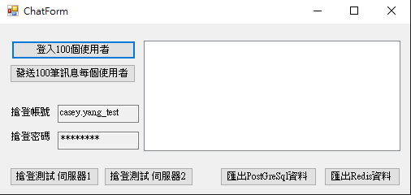
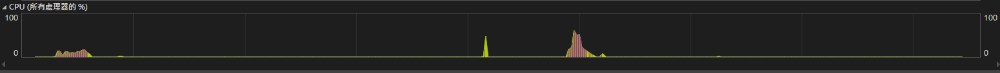

# Prerequisite
#### 1. Create a database named ``mydb`` in PostgreSQL.
#### 2. Create a table named ``users`` by running the following SQL command:
```sql
CREATE TABLE users (
    account VARCHAR(50) NOT NULL,
    password_hash VARCHAR(255) NOT NULL,
    PRIMARY KEY (account)
);
```
#### 3. Create a table named ``chatroom_message`` by running the following SQL command:
```sql
CREATE TABLE chatroom_message (
    id SERIAL PRIMARY KEY,
    message TEXT NOT NULL,
    created_at TIMESTAMP DEFAULT CURRENT_TIMESTAMP
);
```
### 4. Ensure that Redis is running on port 6379.    
&nbsp;
# Run step
#### 1. After building the project, go to Test.server\bin\release and run ``Test.Server.exe``.
#### 2. The first time you start the server, it will create user data and insert it into the ``users`` table.
#### 2. Go to ``Test.Client\bin\release`` and run ``Test.Client.exe``. After running ``Test.Client.exe``, a WinForms app will open, and you will see the following window:

&nbsp;
  * Button ``登入100個使用者``: Logs in 100 users to either server1 or server2 randomly.
  * Button ``發送100筆訊息美個使用者``: Sends 100 messages per user to the connected server. After receiving all the messages from all users, each user will export a message log file as a ``.txt`` file to ``the path Test.Client\bin\Release\Client_log``.
  * ``搶登帳號`` and ``搶登密碼`` sections are for concurrent login testing of accounts and passwords.
  * Button ``搶登測試 伺服器1``: Logs in to server1, retrieves the latest 100 messages, and exports them as a ``.txt`` file to the path ``Test.Client\bin\Release\concurrent_log``.
  * Button ``搶登測試 伺服器2``: Logs in to server2, retrieves the latest 100 messages, and exports them as a ``.txt`` file to the path ``Test.Client\bin\Release\concurrent_log``.
  * Button ``匯出PostGreSql資料``: Exports 10,000 messages received from users as a ``.txt`` file to the path ``Test.Client\bin\Release\DB_Data``.
  * Button ``匯出Redis資料``: Exports 10,000 messages received from users as a ``.txt`` file to the path ``Test.Client\bin\Release\DB_Data.``

#### 4. After opening the window, follow these steps:
* Click the button ``登入100個使用者``.
* Click the button ``發送100筆訊息每個使用者``.
* Click the button ``搶登測試 伺服器1``.
* Click the button ``搶登測試 伺服器2``.
* Click the button ``匯出PostgreSQL資料``.
* Click the button ``匯出Redis資料``.
# Verification
#### 1.Message Consistency: Verify that the data in PostgreSQL and Redis, as well as the user chat log message order and number, are identical.
#### 2.Concurrent Login Message Consistency: Ensure that the order and number of messages in the concurrent login message logs are consistent.
#### 3. Login Time of 100 Users: The login time for 100 users will be displayed in the WinForms app window.
#### 4. Receive Time of All Messages from All Users: The time when all messages are received from all users will be displayed in the WinForms app window.
### 5. CPU usuage: 

    
